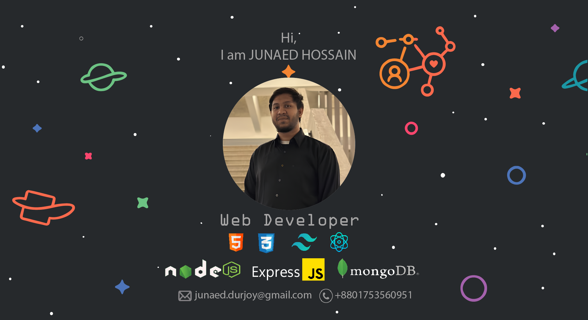

<h1 align="center">Hi 👋, I'm Junaed Hossain</h1>
<h3 align="center">A passionate Web Developer.</h3>

  

- 💬 I consider myself a responsible and orderly person. I am looking forward to a
responsible career opportunity to fully utilize my educational knowledge and
skills while making a contribution to the company.

- 👨‍💻 My portfolio: [https://junaeddurjoy.github.io/my-portfolio/](https://junaeddurjoy.github.io/my-portfolio/)

- 📫 How to reach me **junaed.durjoy@gmail.com**

<h3 align="left">Connect with me:</h3>

<h3 align="left">Languages and Tools:</h3>
<!-- add -->

&nbsp;

